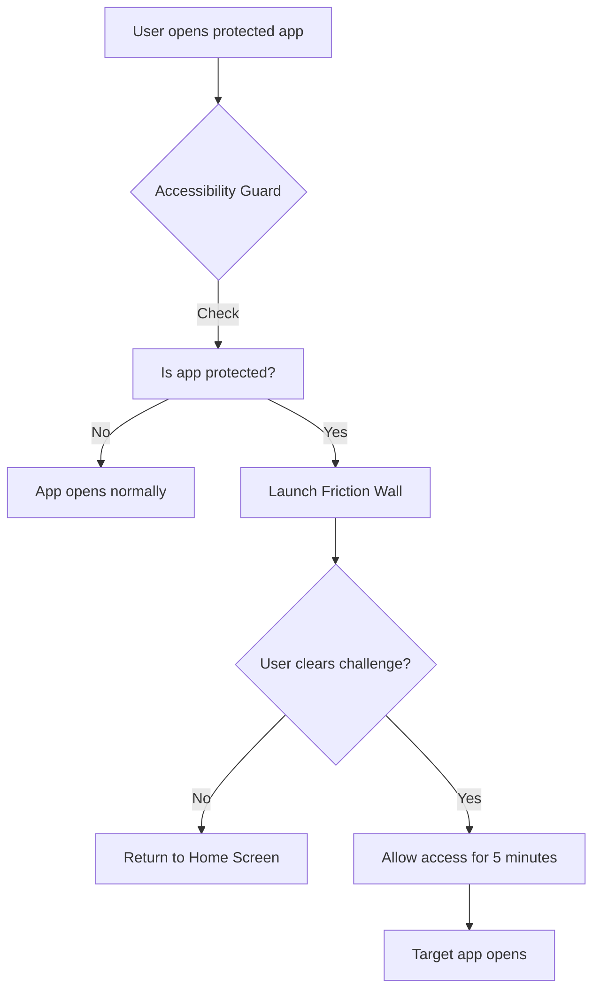

# Friction App Architecture

This app acts as a "digital speed bump" for your phone. Here is a simple breakdown of how it works:

## 1. The Components

### 🧠 The Brain (Accessibility Service)
Think of this as an invisible guard that sits in the background. Every time you tap an icon to open an app, the guard looks at the name of the app. If it's an app you've chosen to protect (like Instagram or X), the guard quickly jumps in and places a "wall" in front of it.

### 🧱 The Wall (Friction Wall Activity)
This is the screen that pops up. It doesn't permanently block you; it just makes you slow down. It presents a "challenge" (like breathing for a few seconds) to break the habit of mindless clicking.

### 📁 The Memory (Room Database)
The app needs to remember which apps you want to block and how many times you've opened them today. It uses a small, efficient database to keep track of your "Time Saved" and your daily progress.

### 🕹️ The Control Center (Home Screen)
This is where you tell the app which "speed bumps" you want to turn on and choose which specific challenge you want to use.

---

## 2. Modifying Waiting Strategies (Challenges)

The app currently has three main strategies: **Breathing**, **Math**, and **Typing**. If you want to add a new one or remove an existing one, here is where to look:

### To Add a New Strategy:
1.  **Define the Name**: Add a new entry to the `FrictionMode` list in `FrictionMode.kt`. For example: `SUDOKU` or `WAIT_ONLY`.
2.  **Create the UI**: In `FrictionWallActivity.kt`, create a new "Composable" function (like `BreathingChallenge`) that defines what the new challenge looks like.
3.  **Connect the Dots**: Update the `FrictionWallScreen` function in the same file to show your new challenge when that mode is selected.
4.  **Update Settings**: Make sure the new mode appears in the settings menu on the Home Screen so you can actually select it.

### To Remove a Strategy:
1.  **Delete the UI**: Simply remove the specific challenge function from `FrictionWallActivity.kt`.
2.  **Clean up the List**: Remove the entry from the `FrictionMode` list.
3.  **Update settings**: Remove the option from the user interface so it can no longer be chosen.

> [!TIP]
> Each strategy should ideally have a "timer" or a "success condition." Once it finishes, it calls a function named `onAllowAccess` which lets you through to your target app.

## 3. Visual Flow

